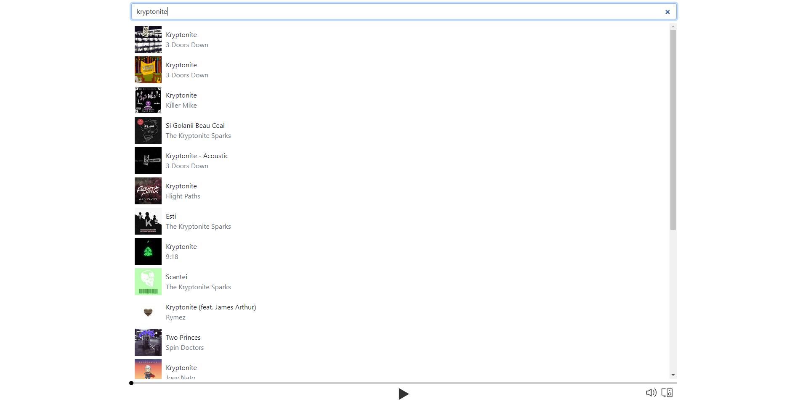
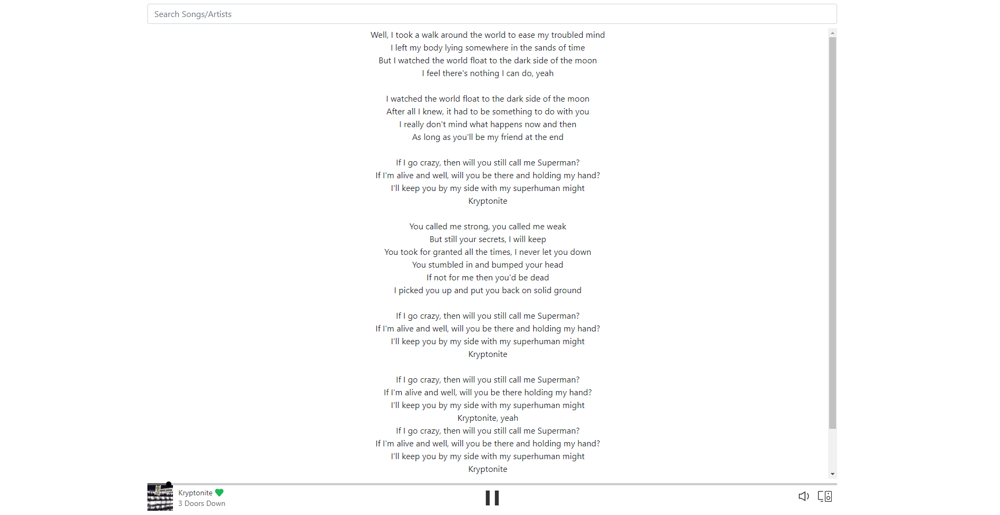

# Spotify App

The app is not working online because of the spotify rules.
You can test the up if you create a spotify app at:https://developer.spotify.com/ and update the environment variables with your credentials

### Features of the App
- You can log in with your spotify account
- You can search any song and get results like on spotify
- If you click on a song you can listen to it and add it to your library or remove it
- You can turn up and down the volume

Preview 1:

Preview 2:

